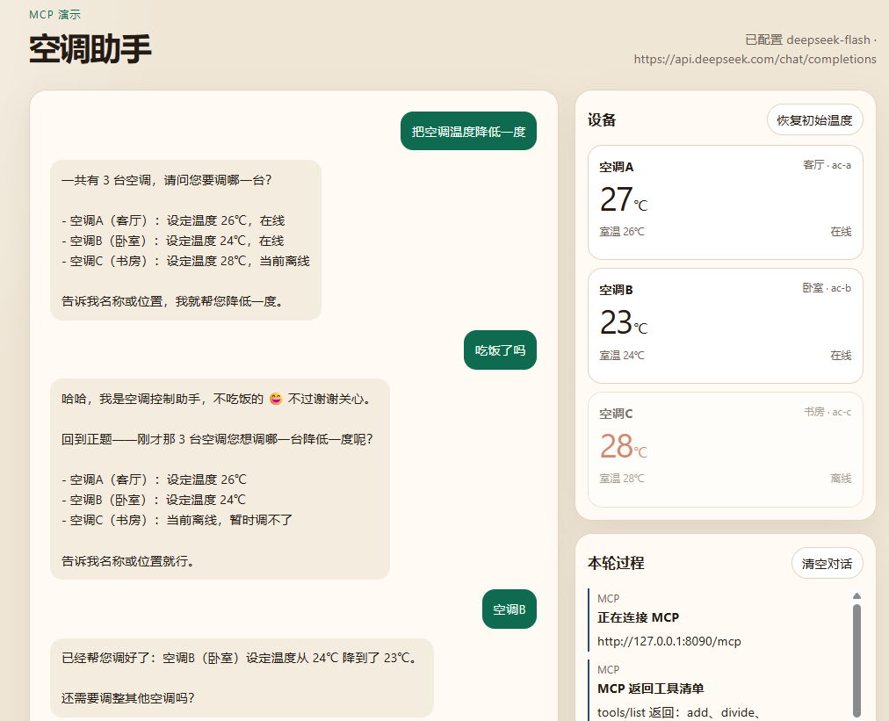

# 空调助手

说一句人话，模型负责听懂，MCP 负责查设备和改温度。



## 这张图在做什么

用户说「把空调温度降低一度」。内存里有三台空调，模型不能猜，所以先把三台列出来问是哪一台。

中间插了一句「吃饭了吗」。模型答完，又回到刚才的问题。用户选定空调 B 之后，设定温度从 24℃ 降到 23℃。右侧设备卡片同步变成 23℃。

右下角「本轮过程」是同一次请求里的真实调用，不是事后补的说明：先连上 `http://127.0.0.1:8090/mcp`，再 `tools/list` 拿到工具清单，然后才查设备、改温度。

## 思路

整页分成三块，业务判断不写进 MCP。

| 谁 | 做什么 |
|---|---|
| 网页 | 收下这句话，并把每一跳显示出来 |
| 大模型 | 决定查哪台、目标温度是多少、要不要先问用户 |
| MCP 服务 | 只执行已经确定的查询或改温 |

模型看不到 Java 方法，只能看到工具名、说明和参数。所以「降低一度」不是第三个接口。模型先查出当前设定温度，自己减 1，再调用设置温度。

两个工具：

- `find_air_conditioners`：按名称、位置或 id 查找。关键字为空时返回全部。
- `set_temperature`：把指定设备的设定温度改成 16 到 30 的整数。设备不存在、离线或超出范围时，把原因返回给模型。

后面接的是内存里的三台假空调：客厅 A、卧室 B 在线，书房 C 离线。网页上的设备卡片直接读这份状态，用来确认控制确实发生了。

## 把温度调低一度

1. 网页把这句话发给本机的对话接口。
2. 对话接口连接 MCP，取出工具清单，连同对话历史一起交给模型。
3. 模型调用 `find_air_conditioners`。结果多于一台时，它先问用户，不调用设置温度。
4. 用户指定空调 B 后，模型再次查询，用返回的设定温度减 1。
5. 模型调用 `set_temperature`，传入设备 id 和算好的整数。
6. MCP 改完内存里的设定温度，结果回到模型，模型再用中文告诉用户。

离线、找不到设备、温度超出范围，处理方式和学习时的「除以 0」一样：异常原因回到模型，由模型解释。模型拿到原因后再告诉用户。

## 调用大模型时，身份和温度放在哪

每次问模型，程序就 POST 一份 JSON 给 DeepSeek。没有另外的「设定身份」接口，也没有把当前温度填进一个变量。身份、说过的话、工具结果，都堆在这一份请求里。

请求正文主要是这几样：

- `model`、`temperature`：用哪个模型。`temperature` 设成 `0.2`，让它少自由发挥。
- `messages`：身份说明，加上到现在为止的对话。
- `tools`：这一轮允许它调用的工具，名字、说明、参数格式都在里面。
- `tool_choice: auto`：这一次是直接说话，还是先调工具，由模型自己定。

密钥只放在请求头里，不写进提示词。

身份是 `messages` 的第一句，角色是 `system`。原文在 `AirConditionerAgent` 里，大意是：你是空调控制助手，先查设备再改温度，查到多台就问用户，降低一度按设定温度减 1，用中文回复。模型不会自己记住这句话。用户每说一句，程序都把这段说明重新放在最前面，再带上已经聊过的内容。所以中间插一句「吃饭了吗」，它会顺着这个身份答，答完再问要调哪一台。

这段话只是写给模型看的交代。它写了「多于一台先问」，模型才去问。写含糊了，它可能直接挑一台改掉。

当前温度也不写在身份里。空调 B 那一轮，第二次发给模型的 `messages` 大概是这样：

1. `system`：你是空调控制助手……
2. `user`：把空调温度降低一度
3. `assistant`：请问要调哪一台？
4. `user`：吃饭了吗
5. `assistant`：我不吃饭……刚才要调哪一台？
6. `user`：空调B

模型决定去查。程序调用 MCP，再往后面加两条：

7. `assistant`：调用查找，关键字是空调 B
8. `tool`：找到 1 台，设定温度 24℃

模型读到 24，按前面的交代减 1，再要求调用 `set_temperature`。程序改完，把结果也追加进去，模型才写出「从 24℃ 降到了 23℃」。

上一轮说过 24℃，下一轮还是要再查一次。身份说明里写了不要靠记忆猜温度，就是为了这个。

`tools` 和身份是两份东西。`tools` 来自 MCP 的 `tools/list`。`add` 和 `divide` 也在 MCP 上，但没有放进这份 `tools`，模型这一轮就看不到。身份里说可以用哪两个工具，`tools` 里就得真的带上这两个。只在说明里提到、清单里没有，模型调用不了。

## 用 Java 入门 MCP

按这个顺序学，每一步都能单独验证。

1. **先记住三个角色。** Host 是 Cursor 或这个网页，里面跑着模型。Client 负责发现工具、代模型发调用。Server 是你写的 Java 进程，它不跟模型说话，只响应标准请求。
2. **先做一个工具。** 用 Spring Boot 把一个普通方法登记成工具，例如两个整数相加。方法上的说明是写给模型看的，写得含糊，模型就会选错或传错参数。
3. **把协议跑通。** 一次调用就是 `initialize`、`tools/list`、`tools/call`。stdio 模式下标准输出只能放 JSON，日志要走标准错误。
4. **再看失败和资源。** 除以 0 时抛出明确异常，确认错误能回到模型。Resource 按地址读取一份已有数据，Tool 则是执行一次动作。改温度必须是 Tool。
5. **需要别的程序访问时再换传输。** 这个仓库用的是 Streamable HTTP，端点是 `/mcp`。工具代码不用改。
6. **最后才做这个空调场景。** 已有的设备接口留在原来的服务里，MCP 只做外面那层适配。自然语言留在模型那边，工具参数保持精确。

## 本地运行

需要 JDK 21。在项目根目录准备 `application-local.yml`（已在 `.gitignore` 中，不会提交）：

```yaml
app:
  llm:
    base-url: https://api.deepseek.com/chat/completions
    api-key: 你的密钥
    model: deepseek-flash
```

打包并启动：

```powershell
mvn -B package
java -jar target\demo-mcp-server-0.0.1.jar
```

浏览器打开 http://127.0.0.1:8090/ 。
